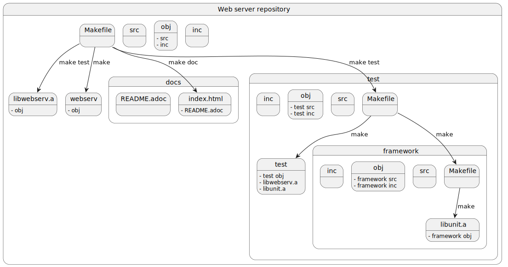

= Web server

== Repository overview

In our project, we created our own unit test framework wrotten in C\++ for testing the C++ functions of our code.

To test request/response, we use a python script running into a docker image.
The python script use the https://requests.readthedocs.io/en/latest/[requests] library.

== The Linux package

Our web server is vailable on the Archlinux user repository: https://aur.archlinux.org/packages/webserv[webserv]

== Contributors

[cols="1,1,1"]
|===
| RobinBurri | 0xCAF3D0OD | t-h2o

| image:https://avatars.githubusercontent.com/u/68509729[RobinBurri, 100, link="https://github.com/RobinBurri"]
| image:https://avatars.githubusercontent.com/u/92105776[0xCAF3D0OD, 100, link="https://github.com/0xCAF3D0OD "]
| image:https://avatars.githubusercontent.com/u/90759286[t-h2o, 100, link="https://github.com/t-h2o"]

|===
